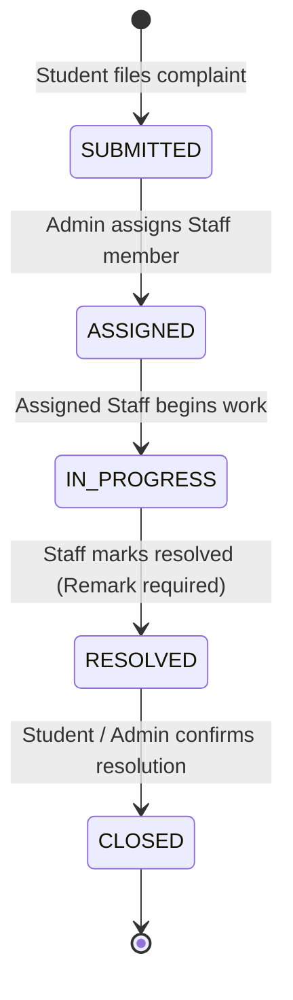
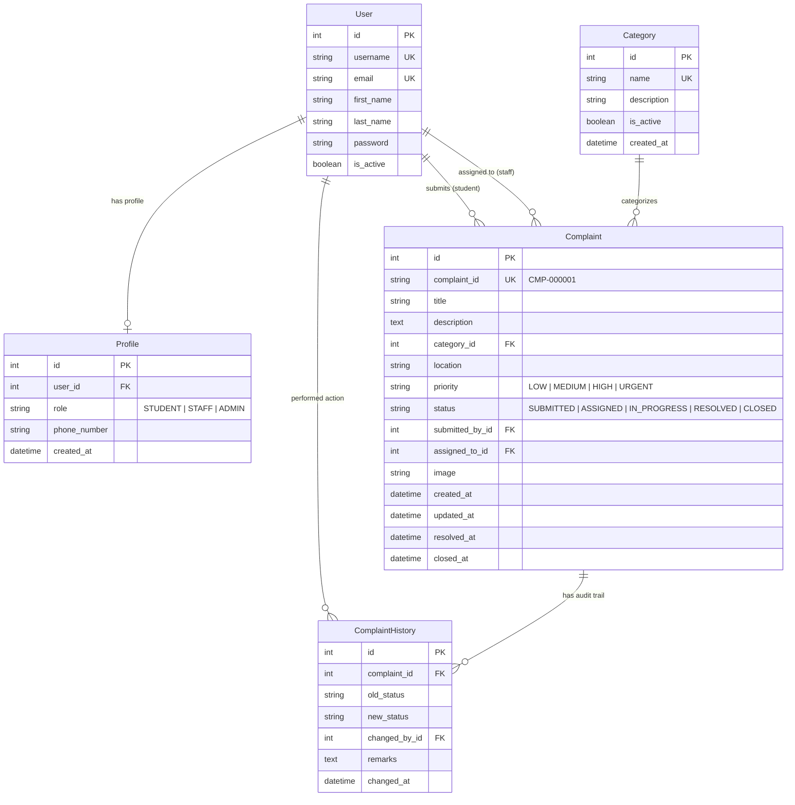

# Campus Infrastructure Complaint & Resolution System

[](https://www.djangoproject.com/)
[](https://www.python.org/)
[](https://www.sqlite.org/)
[](#running-automated-tests)

An enterprise-grade, role-based web application designed for university campuses to streamline facility breakdown reporting, triage, technician assignment, and resolution verification.

---

## Table of Contents
- [Key Features](#key-features)
- [Actors & Role-Based Access Control (RBAC)](#actors--role-based-access-control-rbac)
- [Complaint Lifecycle State Machine](#complaint-lifecycle-state-machine)
- [Technology Stack](#technology-stack)
- [Architecture Overview](#architecture-overview)
- [Database Schema & ER Diagram](#database-schema--er-diagram)
- [Installation & Quick Start](#installation--quick-start)
- [Demo Credentials](#demo-credentials)
- [Running Automated Tests](#running-automated-tests)
- [Screenshots & Visual Tour](#screenshots--visual-tour)
- [Future Enhancements](#future-enhancements)

---

## Key Features

### 🎓 Student Portal
- **Secure Public Registration & Authentication**: Students can register with institutional email, full name, phone number, and password.
- **Complaint Submission Form**: File complaints with auto-generated sequential IDs (`CMP-000001`), category selection, location description, urgency level (`LOW`, `MEDIUM`, `HIGH`, `URGENT`), and optional image attachment (PNG/JPG up to 5MB).
- **Personal Dashboard**: Real-time KPI summary cards (Total Submitted, Pending, In Progress, Resolved, Closed) and search/filter bar by category and status.
- **Audit History & Feedback**: View full timeline of technician notes and officially **Close** resolved tickets once satisfied with the physical repair.

### 🛠️ Staff / Technician Module
- **Assigned Work Queue**: Dedicated dashboard displaying tickets assigned exclusively to the logged-in technician.
- **Status Lifecycle Control**:
  - `ASSIGNED` &rarr; `IN_PROGRESS`: Acknowledge assignment and mark maintenance work started.
  - `IN_PROGRESS` &rarr; `RESOLVED`: Submit technical resolution remarks and capture resolution timestamp (`resolved_at`).
- **Strict Data Scoping & IDOR Defense**: Technicians can only view and update complaints explicitly assigned to them.
- **Resolved Work History**: Archive tab displaying historical work completed by the technician.

### 🏛️ Administrator Portal
- **Real-Time Analytics Dashboard**: Chart.js data visualizations (Complaints by Category, Status Distribution, Priority Breakdown) computed dynamically via server-side Django ORM aggregation.
- **Central Triage & Assignment**: Assign unassigned `SUBMITTED` complaints to active technicians or re-assign ongoing tickets.
- **Comprehensive Filtering**: Multi-parameter search across complaint title, ID, submitter, technician, category, priority, and date range.
- **Category & User Management**: Full CRUD capabilities for maintenance categories and user status activation/deactivation.
- **Administrative Force Close**: Ability to close long-standing resolved tickets.

---

## Actors & Role-Based Access Control (RBAC)

| Capability / URL | Anonymous | STUDENT | STAFF | ADMIN |
| :--- | :---: | :---: | :---: | :---: |
| **Register Account / Login** | ✅ | ✅ | ✅ | ✅ |
| **Submit Complaint** | ❌ (Redirect) | ✅ | ❌ (403) | ❌ (403) |
| **View Own Complaints & Details** | ❌ (Redirect) | ✅ | ❌ (403) | ✅ |
| **Close Own Resolved Ticket** | ❌ (Redirect) | ✅ | ❌ (403) | ✅ |
| **View Staff Assigned Work Queue** | ❌ (Redirect) | ❌ (403) | ✅ | ❌ (403) |
| **Transition Assigned &rarr; In Progress** | ❌ (Redirect) | ❌ (403) | ✅ (Owner only) | ❌ |
| **Transition In Progress &rarr; Resolved** | ❌ (Redirect) | ❌ (403) | ✅ (Owner only) | ❌ |
| **Admin Analytics Dashboard** | ❌ (Redirect) | ❌ (403) | ❌ (403) | ✅ |
| **Assign / Re-Assign Complaints** | ❌ (Redirect) | ❌ (403) | ❌ (403) | ✅ |
| **Category & User Management** | ❌ (Redirect) | ❌ (403) | ❌ (403) | ✅ |

---

## Complaint Lifecycle State Machine

The complaint workflow enforces a strict 5-stage finite state machine at the database service layer:



### State Machine Transition Rules
1. **`SUBMITTED` &rarr; `ASSIGNED`**: Executed by **ADMIN** when assigning `assigned_to` technician.
2. **`ASSIGNED` &rarr; `IN_PROGRESS`**: Executed exclusively by the **assigned STAFF** member.
3. **`IN_PROGRESS` &rarr; `RESOLVED`**: Executed exclusively by the **assigned STAFF** member; requires non-empty resolution remark; sets `resolved_at`.
4. **`RESOLVED` &rarr; `CLOSED`**: Executed by **STUDENT** (owner) or **ADMIN**; sets `closed_at`.
5. **Illegal Jumps Blocked**: Any out-of-order transition (e.g. `SUBMITTED` &rarr; `RESOLVED`, `SUBMITTED` &rarr; `CLOSED`) or unauthorized actor call is rejected with a descriptive error.

---

## Technology Stack

- **Backend Framework**: Python 3.11+ / Django 5.0+
- **Database Engine**: SQLite (Development / Demo) / PostgreSQL compatible
- **Image Processing**: Pillow (secure format validation & 5MB file limit enforcement)
- **Frontend Architecture**: Server-Side Rendered Django Templates (HTML5, Semantic UI)
- **Styling**: Modern Vanilla CSS Design System with Glassmorphism, Dark/Light palettes, and Micro-interactions
- **Data Visualization**: Chart.js (Responsive Canvas charts driven by dynamic server-rendered JSON aggregates)
- **Icons**: Handcrafted lightweight SVG icon system

---

## Architecture Overview

The codebase is organized into modular Django applications following the Model-View-Template (MVT) pattern with service-layer business logic:

```text
campus_complaint_system/
├── accounts/                  # User management, Profiles, RBAC decorators & auth views
│   ├── decorators.py          # @role_required, @student_required, @staff_required, @admin_required
│   ├── models.py              # Profile model with OneToOne User mapping & role enum
│   ├── views.py               # Login, Register, Logout, Profile views
│   └── tests.py               # 14 Authentication & RBAC unit tests
├── complaints/                # Complaint domain models, state machine, and student portal
│   ├── models.py              # Category, Complaint (with transition_to logic), ComplaintHistory
│   ├── forms.py               # Student complaint submission & validation forms
│   ├── views.py               # Student dashboard, creation, detail, and closure views
│   ├── management/commands/   # Custom seed_demo_data command
│   └── tests.py               # 12 State machine & student workflow tests
├── dashboard/                 # Admin and Staff dashboards, analytics, and category management
│   ├── views.py               # Admin dashboard, assign, analytics, staff queue, resolve views
│   ├── tests.py               # 21 Admin, Staff, Analytics, and Security tests
│   └── urls.py                # Dashboard routing
├── templates/                 # Reusable base templates & custom error handlers (403, 404, 500)
├── static/                    # CSS stylesheets, JavaScript files, and theme assets
├── media/                     # User-uploaded complaint attachment images
├── requirements.txt           # Pinned production dependencies
└── manage.py                  # Django CLI runner
```

---

## Database Schema & ER Diagram



---

## Installation & Quick Start

### 1. Clone the Repository
```bash
git clone https://github.com/SonalJOY/campus-complaint-system.git
cd campus-complaint-system
```

### 2. Create and Activate a Virtual Environment
```bash
# Windows
python -m venv venv
venv\Scripts\activate

# macOS / Linux
python3 -m venv venv
source venv/bin/activate
```

### 3. Install Required Dependencies
```bash
pip install -r requirements.txt
```

### 4. Run Database Migrations
```bash
python manage.py migrate
```

### 5. Seed Demo Users & Realistic Dataset
Run the custom management command to seed demo users, 8 standard categories, and 18 diverse sample complaints:
```bash
python manage.py seed_demo_data --clear
```

### 6. Start the Development Server
```bash
python manage.py runserver
```
Visit `http://127.0.0.1:8000/` in your browser.

---

## Demo Credentials

The seed command initializes the following demo accounts:

| Role | Username | Password | Email | Description |
| :--- | :--- | :--- | :--- | :--- |
| **ADMIN** | `admin` | `admin` | `admin@campus.edu` | Full administrative triage, reassignment, analytics & category management |
| **STAFF** | `staff1` | `staff1pass` | `staff1@campus.edu` | Senior Technician (Electrical, Network, General) |
| **STAFF** | `staff2` | `staff2pass` | `staff2@campus.edu` | Maintenance Specialist (Plumbing, HVAC, Carpentry) |
| **STUDENT** | `student1` | `student1pass` | `student1@campus.edu` | Registered student with active, in-progress & closed tickets |
| **STUDENT** | `student2` | `student2pass` | `student2@campus.edu` | Registered student with tickets across multiple categories |
| **STUDENT** | `student3` | `student3pass` | `student3@campus.edu` | Registered student for ownership & IDOR validation |

---

## Running Automated Tests

The application includes a test suite with **47 test cases** covering Authentication, Model State Machines, Authorization, IDOR Defense, Analytics Payload Integrity, and Custom Error Handling:

```bash
# Run the entire test suite
python manage.py test

# Run tests with verbose output
python manage.py test -v 2

# Run specific application tests
python manage.py test accounts
python manage.py test complaints
python manage.py test dashboard
```

---

## Screenshots & Visual Tour

> **Note for Contributors**: Place captured screenshots in the `docs/screenshots/` folder using the standard file names below to populate this gallery.

| Screen | Description | Path |
| :--- | :--- | :--- |
| **Admin Analytics Dashboard** | Real-time Chart.js status, category & priority distribution | `docs/screenshots/admin-dashboard.png` |
| **Admin Triage & Assignment** | Complaint queue with staff allocation modal | `docs/screenshots/admin-assignment.png` |
| **Staff Work Queue** | Assigned complaints with start-work and resolve actions | `docs/screenshots/staff-queue.png` |
| **Student Complaint Filing** | Submission form with image upload and validation | `docs/screenshots/student-submit.png` |
| **Student Ticket Tracking** | Timeline audit trail and resolution confirmation | `docs/screenshots/student-detail.png` |

---

## Future Enhancements

The following architectural enhancements were intentionally scoped out for the initial core release and can be integrated in subsequent milestones:

1. **Asynchronous Notifications**: Email and SMS dispatching via Celery worker queues and Redis.
2. **REST API & Mobile Client**: Django REST Framework (DRF) endpoints with JWT authentication for native iOS/Android campus apps.
3. **Real-Time Live Updates**: WebSocket push notifications via Django Channels for instant dashboard ticket refresh.
4. **Export & Reporting**: CSV, Excel, and PDF report generation for departmental SLA auditing.
5. **Theme Customization**: Dark / Light theme toggle with user preference persistence.
6. **SLA Escalation Engine**: Automated escalation for high-priority tickets remaining unassigned for over 24 hours.

---

## License & Authors
- **Developed by**: SonalJOY (sonaljoy2@gmail.com)
- **Course**: Software Engineering / Project Management Capstone
